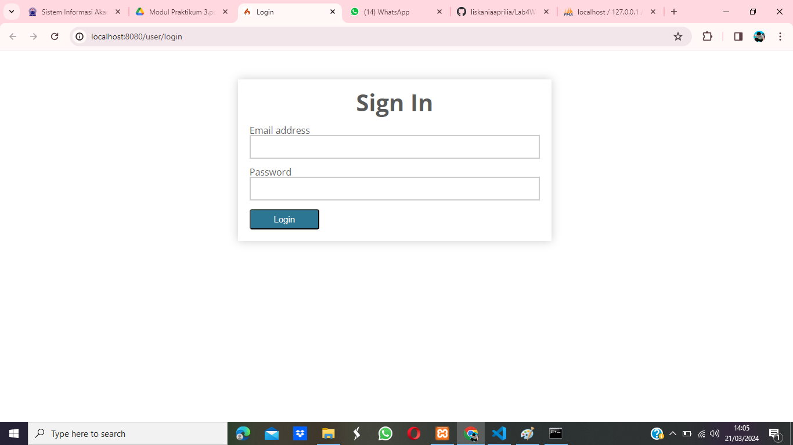

# Framework Lanjutan (Modul Login)

### Persiapan.

Untuk memulai membuat modul Login, yang perlu disiapkan adalah database server menggunakan MySQL. Pastikan MySQL Server sudah dapat dijalankan melalui XAMPP.


### Membuat Tabel: User Login

```mysql
CREATE TABLE user (
    id INT(11) auto_increment,
    username VARCHAR(200) NOT NULL,
    useremail VARCHAR(200),
    userpassword VARCHAR(200),
    PRIMARY KEY(id)
);
```

### Membuat Model User

Selanjutnya adalah membuat Model untuk memproses data Login. Buat file baru pada direktori app/Models dengan nama UserModel.php

```php
<?php

namespace App\Models;

use CodeIgniter\Model;

class UserModel extends Model
{
    protected $table = 'user';
    protected $primaryKey = 'id';
    protected $useAutoIncrement = true;
    protected $allowedFields = ['username', 'useremail', 'userpassword'];
}
```

### Membuat Controller User

Buat Controller baru dengan nama User.php pada direktori app/Controllers. Kemudian tambahkan method index() untuk menampilkan daftar user, dan method login() untuk proses login.

```php
<?php

namespace App\Controllers;

use App\Models\UserModel;

class User extends BaseController
{
    public function index()
    {
        $title = 'Daftar User';
        $model = new UserModel();
        $users = $model->findAll();
        return view('user/index', compact('users', 'title'));
    }

    public function login()
    {
        helper(['form']);
        $email = $this->request->getPost('email');
        $password = $this->request->getPost('password');

        if (!$email) {
            return view('user/login');
        }

        $session = session();
        $model = new UserModel();
        $login = $model->where('useremail', $email)->first();

        if ($login) {
            $pass = $login['userpassword'];
            if (password_verify($password, $pass)) {
                $login_data = [
                    'user_id' => $login['id'],
                    'user_name' => $login['username'],
                    'user_email' => $login['useremail'],
                    'logged_in' => TRUE,
                ];
                $session->set($login_data);
                return redirect('admin/artikel');
            } else {
                $session->setFlashdata("flash_msg", "Password salah.");
                return redirect()->to('/user/login');
            }
        } else {
            $session->setFlashdata("flash_msg", "Email tidak terdaftar.");
            return redirect()->to('/user/login');
        }
    }
}
```

### Membuat View Login

Buat direktori baru dengan nama user pada direktori app/views, kemudian buat file baru dengan nama login.php.

```html
<!DOCTYPE html>
<html lang="en">
  <head>
    <meta charset="UTF-8" />
    <title>Login</title>
    <link rel="stylesheet" href="<?= base_url('/style.css');?>" />
  </head>
  <body>
    <div id="login-wrapper">
      <h1>Sign In</h1>
      <?php if(session()->getFlashdata('flash_msg')):?>
      <div class="alert alert-danger">
        <?= session()->getFlashdata('flash_msg') ?>
      </div>
      <?php endif;?>
      <form action="" method="post">
        <div class="mb-3">
          <label for="InputForEmail" class="form-label">Email address</label>
          <input
            type="email"
            name="email"
            class="form-control"
            id="InputForEmail"
            value="<?= set_value('email') ?>"
          />
        </div>
        <div class="mb-3">
          <label for="InputForPassword" class="form-label">Password</label>
          <input
            type="password"
            name="password"
            class="form-control"
            id="InputForPassword"
          />
        </div>
        <button type="submit" class="btn btn-primary">Login</button>
      </form>
    </div>
  </body>
</html>
```

### Membuat Database Seeder

Database seeder digunakan untuk membuat data dummy. Untuk keperluan ujicoba modul login, kita perlu memasukkan data user dan password kedaalam database. Untuk itu buat database seeder untuk tabel user. Buka CLI, kemudian tulis perintah berikut:

```
php spark make:seeder UserSeeder
```

Selanjutnya, buka file UserSeeder.php yang berada di lokasi direktori /app/Database/Seeds/UserSeeder.php kemudian isi dengan kode berikut:

```php
<?php

namespace App\Database\Seeds;

use CodeIgniter\Database\Seeder;

class UserSeeder extends Seeder
{
    public function run()
    {
        $model = model('UserModel');
        $model->insert([
            'username' => 'admin',
            'useremail' => 'admin@email.com',
            'userpassword' => password_hash('admin123', PASSWORD_DEFAULT),
        ]);
    }
}
```

Selanjutnya buka kembali CLI dan ketik perintah berikut:

```
php spark db:seed UserSeeder
```

### Uji Coba Login

Selanjutnya buka url http://localhost:8080/user/login seperti berikut:



### Menambahkan Auth Filter

Selanjutnya membuat filer untuk halaman admin. Buat file baru dengan nama Auth.php pada direktori app/Filters.

```php
<?php

namespace App\Filters;

use CodeIgniter\HTTP\RequestInterface;
use CodeIgniter\HTTP\ResponseInterface;
use CodeIgniter\Filters\FilterInterface;

class Auth implements FilterInterface
{
    public function before(RequestInterface $request, $arguments = null)
    {
        // Jika user belum login
        if (!session()->get('logged_in')) {
            // Maka redirect ke halaman login
            return redirect()->to('/user/login');
        }
    }

    public function after(RequestInterface $request, ResponseInterface $response, $arguments = null)
    {
        // Do something here
    }
}
```

Selanjutnya buka file app/Config/Filters.php tambahkan kode berikut:

```
'auth' => App\Filters\Auth::class
```

Selanjutnya buka file app/Config/Routes.php dan sesuaikan kodenya.

```
['filter' => 'auth']
```

### Percobaan Akses Menu Admin

Buka url dengan alamat http://localhost:8080/admin/artikel ketika alamat tersebut diakses maka, akan dimuculkan halaman login.

### Fungsi Logout

Tambahkan method logout pada Controller User seperti berikut:

```
public function logout()
{
    session()->destroy();
    return redirect()->to('/user/login');
}
```

# FINISH
